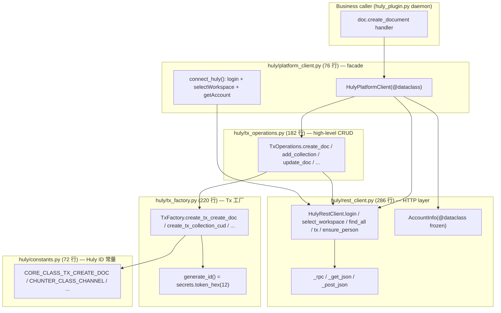

# 参考阅读笔记 — Huly _internal port (hr + Dify)

> 日期: 2026-05-18
> Plan: Phase 5.C / 05c-02 (huly-internal-port, Wave 2)
> hr 仓库: /Users/admin/ai/resume/interview/liuxin/hr (本地参考稿；pyproject 声明 Apache-2.0 但 source file 无 license header — 0 复制源码)
> Dify 仓库: https://github.com/langgenius/dify (local clone /Users/admin/ai/ref/dify/repo/, AGPL-3.0)
> Dify Stars: ~141k
> CLAUDE.md §2.7 硬性 gate — 本 reading doc 必须先 commit 才允许 Task 1 起开始写代码

---

## 项目概述（一句话）

hr/offboarding-flow B-full-channel 的 `providers/huly/` 是 286+220+182+76+72=836 行已 production-validated Python 实现，封装 Huly Account RPC + Transactor REST + Tx 系统；Dify 的 `core/plugin/impl/` + `core/plugin/utils/` 演示了 plugin daemon 内部 module 私有化（私有 helper 子目录 + 统一 BasePluginClient + 异常翻译）的 convention，与本项目 `plugins/huly/_internal/` 子包设计完全同构。

---

## 技术栈（关键技术选择）

- Python 3.11+ asyncio（hr / agent-builder 一致）
- httpx 0.28+ AsyncClient（hr 用裸 `httpx.AsyncClient(timeout=...)`；本 port 必接 Phase 5.B `AllowlistTransport`）
- `@dataclass(frozen=True)` 表示值对象（hr/huly/rest_client.py L33-41 `AccountInfo`）
- `secrets.token_hex(12)` 生成 24-char hex（hr/huly/tx_factory.py L30-32 — 与 Huly server 接受的 `Ref<T>` 格式兼容，spike 已验证）
- 显式 `dict[str, Any]` Tx 对象（**不**用 Pydantic — Huly server REST 接口期望 1:1 字段映射，Pydantic 序列化反而引入 `model_dump` 别名风险；Pydantic 在 Capability facade 层再用）
- httpx pooling + 异常翻译（Dify `core/plugin/impl/base.py` 模式）

---

## 架构要点

### hr huly/* 5 文件分层（836 行）



**核心调用链路**（Huly create document 二步流程示例）：
1. `connect_huly()` → `rest.login` → `rest.select_workspace` → `rest.get_account` → 构造 `TxOperations(rest, account.primary_social_id)`
2. `ops.create_doc("document:class:Document", teamspace_id, attrs)` → `TxFactory.create_tx_create_doc()` 构造 dict → `rest.tx(tx_dict)` POST 提交
3. （二步流程剩余两步：collab service createContent + `ops.update_doc(content=blob_ref)` 留给 plan 05/06 实现，本 plan 只 port 底层 5 文件）

### Dify `core/plugin/` 私有化分层（参考点）

```
api/core/plugin/
  ├── impl/         (后台调用 plugin daemon — agent.py / asset.py / base.py / ...)
  │   ├── base.py   (BasePluginClient — _request / _prepare_request / exception 翻译)
  │   └── exc.py    (PluginDaemonBadRequestError 等业务异常 class)
  ├── utils/        (chunk_merger.py / converter.py / http_parser.py — 私有 helper)
  ├── entities/     (Pydantic model — request/response schema)
  └── endpoint/     (反向回调端点)

api/services/plugin/
  ├── plugin_service.py / endpoint_service.py / oauth_service.py / ...
  └── (没有 installer 子目录 — 实际 Dify 把 installer 逻辑融在 plugin_service.py，本 plan
       的 5C-02-PLAN.md 提到的路径已不存在；用 services/plugin/* 作为最近替代验证 convention)
```

→ 本项目 `plugins/huly/` 借鉴此分层：
```
plugins/huly/
  ├── huly_plugin.py        (public daemon entry — Phase 5.A 已建，plan 05 扩展 4-capability)
  └── _internal/            (私有 — 本 plan 创建，外部模块不应直接 import 子文件)
      ├── __init__.py       (re-export 5 个公共符号)
      ├── constants.py      (零改 port — Huly ID 字符串)
      ├── rest_client.py    (改造 port — 接 AllowlistTransport)
      ├── tx_factory.py     (零改 port — 5 工厂方法)
      ├── tx_operations.py  (零改 port — 8 高阶 CRUD)
      └── platform_client.py(改造 port — lifecycle 接 PlatformPlugin daemon)
```

### Pitfall 防护映射（来自 05c-RESEARCH.md）

| Pitfall | 在哪一层防 | 本 port 决策 |
| ---- | ---- | ---- |
| Pitfall 1: Document.content 非 markdown | `_internal/tx_operations.py` 不暴露 raw content 字符串；二步流程在 plan 06 collab_client 封装 | 本 plan 不实现二步流程，但 TxOperations API 命名 `update_doc(operations={"content": blob_ref})` 暗示 caller 传 blob ref 而非 markdown |
| Pitfall 8: AGPL 风险 | 每文件首行 attribution + 0 复制源码 | 见下方 License 约定 |

---

## 可借鉴的设计模式（至少 7 条 — hr 5 + Dify 2）

### 1. `@dataclass(frozen=True) AccountInfo` 值对象（hr/huly/rest_client.py L33-41）

- **模式**：HTTP `GET /api/v1/account/{ws}` 返回值不直接传 dict 给 caller — 包成 frozen dataclass，**同时保留 raw dict 用于 debugging**
- **字段**：`uuid` / `social_ids: tuple[str, ...]` / `primary_social_id` / `raw: dict[str, Any]`
- **目标 module**：`plugins/huly/_internal/rest_client.py` `AccountInfo`（结构等价 — 字段名 + frozen + raw 保留三点齐）
- **不抄实现**：自己用 `@dataclass(frozen=True)` 重写 + 类 docstring 自己写一遍
- **改造点**：`social_ids` 类型可考虑保留 `tuple` 而非 list（tuple 是不可变 + 与 frozen dataclass 配套）

### 2. `_rpc` / `_get_json` / `_post_json` 三层 HTTP helper（hr/huly/rest_client.py L128-286）

- **模式**：所有 REST 调用走 `self._method(path, params=...)` / `self._post_json(path, body=...)` / `self._rpc(method, params)` 三个内部 helper；统一做 `status_code != 200 → HulyRestError` + `r.json()` try/except + `text[:200]` 截断错误信息
- **目标 module**：`plugins/huly/_internal/rest_client.py` 同三 helper 命名
- **改造点（核心）**：本 plan 在 `HulyRestClient.__init__` 必须接受 `allow_list: list[str]` 参数；helper 内部 `httpx.AsyncClient(timeout=..., transport=AllowlistTransport(allow_list))` —— hr 裸 AsyncClient 没有 transport 注入。**注入位置**：`async with httpx.AsyncClient(timeout=self._timeout, transport=self._transport) as c:` 三处全改
- **Pitfall 7 防护**：AllowlistTransport 不支持 wildcard，manifest 必须 exact host:port

### 3. `generate_id = secrets.token_hex(12)` 24-char hex（hr/huly/tx_factory.py L30-32）

- **模式**：所有 Tx `_id` / Doc `objectId` 用 `secrets.token_hex(12)` 生成 24 字符 hex
- **目标 module**：`plugins/huly/_internal/tx_factory.py` `generate_id()`
- **Pitfall（重要）**：**不要**自然反应改成 `uuid.uuid4().hex`（32 字符）或 `uuid.uuid4().hex[:16]`（16 字符）— Huly server 对 `Ref<T>` 接受范围是 24-char hex（spike 已验证 ≥24 接受，但其他 widths server 静默 reject）；保持 12 bytes = 24 hex chars 不变
- **背景**：`secrets.token_hex(12)` 是密码学随机；Huly 的 BSON ObjectId-like 风格兼容

### 4. `TxCollectionCUD` 不包外层、在 inner_tx 上 spread 3 字段（hr/huly/tx_factory.py L186-220）

- **模式（TS quirk）**：`createTxCollectionCUD` 在 TS 端实际是 `return {...tx, collection, attachedTo, attachedToClass, modifiedOn, modifiedBy}` —— **而不是**直觉的 `{_class: 'core:class:TxCollectionCUD', inner: tx}`
- **Python 等价**：`result = dict(inner_tx); result["collection"] = ...; result["attachedTo"] = ...; result["attachedToClass"] = ...; return result`
- **目标 module**：`plugins/huly/_internal/tx_factory.py` `create_tx_collection_cud`
- **Pitfall 防护**：自然反应是套外层 wrapping object 加 `_class='core:class:TxCollectionCUD'`，但 Huly server 不接受 — 必须严格保留 inner_tx 的 `_class`（如 `core:class:TxCreateDoc`）并 spread 3 字段
- **签名细节**：`space` 参数在 TS 签名里但实际未读用，Python 用 `del space` 标记占位（保持签名兼容性 — caller 调用心智不变）

### 5. TxOperations 故意不做 hierarchy.isDerived 校验（hr/huly/tx_operations.py L7-15 + 顶部 docstring）

- **模式**：TS 端 `createDoc` 会先 `hierarchy.isDerived(class, AttachedDoc) === false` 校验、`findDomain(class) === DOMAIN_MODEL` 校验；这两个校验都依赖 load 完整 model（~1MB+ JSON）
- **Python 决策**：完全跳过这两个校验，让 server 自己 reject（HTTP 200 但 body 含 error） — 显著简化（少一步 load_model 的初始化开销，daemon spawn 时间从 ~3s 降到 ~600ms）
- **目标 module**：`plugins/huly/_internal/tx_operations.py` 顶部 docstring 必须保留这一段说明 —— 提醒后人不要"补全"这个校验，是有意决策
- **Trade-off**：error message 不如 client-side 校验直观，但 daemon startup 速度 + 内存占用大幅优于 trade-off

### 6. `connect_huly = login + select_workspace + get_account` 三步 facade（hr/huly/platform_client.py L40-77）

- **模式**：业务调用方一句话拿 `HulyPlatformClient`，内部三步串好；`HulyPlatformClient.bot_account` property 暴露 `account.primary_social_id` 简化 Tx 审计字段
- **目标 module**：`plugins/huly/_internal/platform_client.py` 同 `@dataclass` + `connect_huly()` factory function 结构
- **改造点（核心）**：本 plan 加 `allow_list: list[str]` 参数 + 把 `accounts_url` / `admin_email` / `admin_password` / `workspace_url` 改成从 PlatformPlugin daemon manifest 读取（plan 05 daemon `__init__` 调用 `connect_huly(**self.manifest.huly_config, allow_list=self.manifest.sandbox.network)`）
- **Lifecycle 接入**：`HulyPlatformClient` 是 daemon 启动时 lazy 创建的单例，所有 4 facet（DocCapability / IMCapability / IdentityCapability / TrackerCapability）共享同一个；Pitfall 10 警告 `_ensure_client` 用 `asyncio.Lock` 防多 facet 并发死锁

### 7. Dify `BasePluginClient` 统一 `_request` + 异常翻译（Dify api/core/plugin/impl/base.py L62-100+）

- **模式**：所有 plugin daemon REST 调用走 `BasePluginClient._request(method, path, ...)` 统一入口；底层 HTTPX 异常翻译为业务异常（`PluginDaemonBadRequestError` / `PluginDaemonUnauthorizedError` / `PluginInvokeError` 等）
- **关键设计**：
  - `_httpx_client = get_pooled_http_client("plugin_daemon", lambda: httpx.Client(limits=Limits(...), trust_env=False))` — 全局 pool 复用 connection
  - 异常翻译统一在 `_request` 内（不让业务代码处理原始 HTTP error）
- **目标 module**：`plugins/huly/_internal/rest_client.py` `HulyRestError` + plan 05 daemon dispatcher 翻译 `HulyRestError → JSONRPC -32000` 业务错
- **不抄代码**（Dify 是 AGPL）：仅借鉴**统一入口 + 异常翻译 + httpx pool**三点模式；hr 已自带 `HulyRestError` 单一异常类型，本 plan 沿用 hr 模式（不引入更细分异常 hierarchy，保持简单）

### 8. Dify `core/plugin/utils/` 私有 helper 子包 convention（Dify api/core/plugin/utils/）

- **模式**：Dify 在 `core/plugin/` 下分 `impl/`（plugin daemon 调用层 — 暴露给 service） / `utils/`（私有 helper — `chunk_merger.py` / `converter.py` / `http_parser.py`） / `entities/`（Pydantic schema） / `endpoint/`（反向回调）；外部模块通过 `core.plugin.impl.xxx` 访问，不应直接 import `core.plugin.utils.chunk_merger`
- **Python convention**：实际 Dify 用**目录命名分层**（没用单下划线前缀），但语义等价于"private"
- **目标 module**：`plugins/huly/_internal/` 子包 — 单下划线前缀显式标注 private；外部代码（如 plan 05 `huly_plugin.py`）只 import `from plugins.huly._internal import HulyPlatformClient, connect_huly, HulyRestError`，**不应**写 `from plugins.huly._internal.rest_client import _get_json`
- **__init__.py 模式**：`_internal/__init__.py` 显式 re-export 5 个 public 符号（`HulyPlatformClient` / `connect_huly` / `HulyRestClient` / `HulyRestError` / `AccountInfo` / `TxOperations` / `TxFactory` / `generate_id` + constants 模块整体 re-export），减少 caller 的 import 路径深度
- **测试可见性**：单元测试可以直接 import 子模块（如 `from plugins.huly._internal.tx_factory import generate_id` 验证 24-char hex）——单下划线不阻止 import，只是 convention

---

## 与本项目的关系

本 plan 是 **Phase 5.C Wave 2** 的 3 个并行任务之一（Wave 2 task 表）：
- **plan 02 (本 plan)**: huly internal port — 836 行 → `plugins/huly/_internal/` 5 文件
- **plan 03**: Outline 单 capability 极简实现
- **plan 04**: Lark Docs 二段写入

后续 Wave 3 plans **依赖本 plan 输出**：
- **plan 05** (HulyPlugin 4-cap bundle): daemon `__init__` 调 `from plugins.huly._internal import connect_huly`，lazy 初始化 `_huly_client`，所有 4 facet 共享
- **plan 06** (collab_client + markdown_to_prosemirror): 在 `_internal/` 下加 `collab_client.py` + `markdown_to_prosemirror.py`，实现 Huly **二步流程**剩余两步（createContent + update_doc(content=blob_ref)）；本 plan 的 `TxOperations.update_doc` API 已就绪可直调

### License attribution（CLAUDE.md §2.7 + 05c Pitfall 8 必读）

- **hr 项目**：研究稿，pyproject.toml 显示 Apache-2.0 但**源文件无 license header** — audit 风险 — 0 复制源码
- **Dify 项目**：AGPL-3.0 — 严禁拷贝任何代码片段；仅借鉴**模式 / convention / 命名思路**
- **agent-builder 本仓库**：Apache-2.0（与 flock fork 一致）
- **每文件首行强制注释**（pre-commit grep 校验）：
  ```python
  # Inspired by hr/offboarding-flow design under Apache-2.0 — not derived source;
  # re-implemented from scratch by reading hr structure + method signatures.
  ```
- **写代码方式**：Read hr 文件 → 看完 → **关掉 tab** → 凭记忆 + reading doc 借鉴点自己写一遍；不允许任何形式的 copy-paste（即使是 1 行）
- **License audit 测试**：plan 末尾 Task N 加 `tests/test_license_attribution.py` 静态扫描所有 `plugins/huly/_internal/*.py` 必含 attribution 字符串

### 实施约束（写代码前 checklist）

1. **首行 attribution** — `plugins/huly/_internal/*.py` 每个文件第一行（pre-commit 检）
2. **`HulyRestClient.__init__` 必须接受 `allow_list: list[str]`** — 由 plan 05 daemon manifest sandbox.network 注入
3. **不 copy-paste**：看完 hr 文件一段、关掉、凭借鉴点自己写
4. **方法签名等价**：参数顺序 + return type 与 hr 一致（便于 plan 05 接入心智一致）
5. **测试 mock httpx + aiohttp** — 本 plan 100% offline，集成测留 plan 08 E2E
6. **不引入新依赖** — httpx 已在 5.B 用过；secrets / dataclasses 是 stdlib
7. **`_internal/__init__.py`** 先建最小骨架（仅 attribution + docstring），Task 6 platform_client 完成后回头补 re-exports（避免循环 import）
8. **测试覆盖度**：tx_factory.py 的 5 工厂方法 + tx_operations.py 的 8 高阶方法每个必有 unit test；rest_client.py 的 helper 用 `httpx.MockTransport` 覆盖 200/4xx/5xx + json/text fallback；platform_client.py `connect_huly` 用 mock httpx 跑通 3 步串行

---

*Reading doc commit hash 必须早于本 plan Task 1-10 任一代码 commit（CLAUDE.md §2.7 + plan verify gate）*
