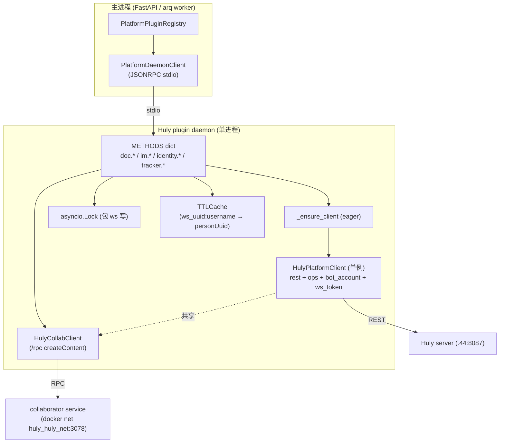
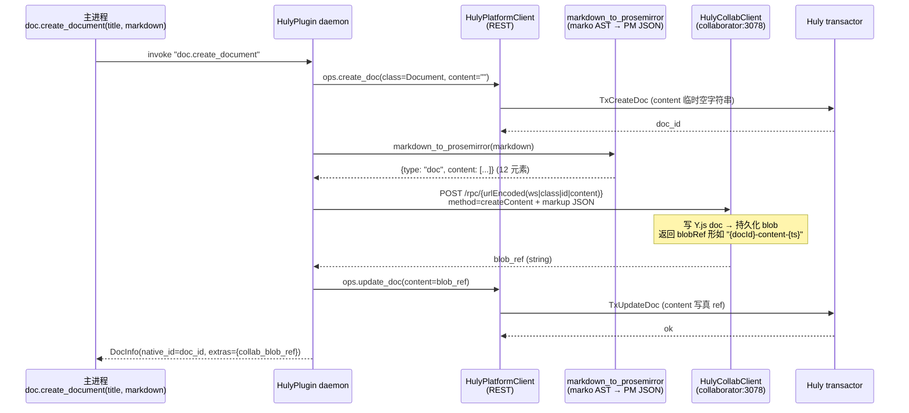

# 参考阅读笔记 — HulyPlugin 4-capability bundle (Dify + hr 实战)

> 日期: 2026-05-18
> Plan: 05c-doc-capability / 05c-05 (Wave 3, 最大 plan, ~45min)
> 参考来源:
> 1. Dify (https://github.com/langgenius/dify, local /Users/admin/ai/ref/dify/repo/, ~141k stars, AGPL-3.0)
> 2. hr/offboarding-flow (LOCAL ONLY, /Users/admin/ai/resume/interview/liuxin/hr/, NOT REDISTRIBUTED, treated as Apache-2.0 但保守对待)
> 3. prosemirror 0.6.1 (https://pypi.org/project/prosemirror/, MIT)
> 4. Huly collaborator-client (https://github.com/hcengineering/huly, AGPL-3.0, **仅借鉴 URL 形态 + Tx 链路**)

---

## 1. 项目概述

HulyPlugin 是本项目第一个真正意义上的 **PlatformBundle**：单 daemon 进程 + 单 `HulyPlatformClient` + 单底层 WS 连接，**同时实现 4 个 Capability facet**（DocCapability / IMCapability / IdentityCapability / TrackerCapability stub）。它是 Phase 5.A acid test mock stub 的**真实生产升级**，把 hr/offboarding-flow B-full-channel 660+ 行 Python 实战经验中提炼的 4 类教训（DM 静默 reject / Document.content 非 raw markdown / PersonUuid 解析慢路径 / collab service blob ref）翻译为可复用插件，并为 Phase 5.D HR + 反向 sync 奠定 IdentityCapability + LRU cache 基础。

与 Phase 5.A OutlinePlugin / LarkDocsPlugin 的本质区别：**前两者是单 capability plugin（doc only / doc+identity 2 facet）；HulyPlugin 是 4 facet 共享 daemon**，这要求 manifest schema、daemon dispatch、并发锁、缓存隔离都升级一档。

---

## 2. 技术栈

| 维度 | 选择 | 理由 |
|------|------|------|
| 语言 | Python 3.11+ asyncio | 与 Phase 5.A daemon 一致；asyncio.Lock 包 ws 写 |
| HTTP | httpx 0.27+ AsyncClient | Phase 5.B AllowlistTransport 兼容 |
| Markdown 解析 | marko 2.2.2 + ASTRenderer | CommonMark 严格 + AST dict 易转换 |
| ProseMirror 验证 | prosemirror 0.6.1 (schema-basic + schema-list) | 2026-02 release，schema-list 1.5.1 |
| 缓存 | cachetools.TTLCache(maxsize=10000, ttl=3600) | LRU + TTL 组合 |
| IPC | JSONRPC over stdio | Phase 5.A acid test 已建主循环 |
| Tx 链路 | 复用 Phase 05c-02 移植的 `_internal/{rest_client,tx_factory,tx_operations,platform_client}.py` | hr 1454 行 → 70% 零改 port |
| 测试 | pytest-asyncio + aiohttp mock server + browser-harness (E2E) | 单元 + 集成 + E2E 三层 |

---

## 3. 架构要点

### 3.1 4 facet 共享 daemon (Pattern 1)



**关键设计点**：
- daemon 启动时 **eager `connect_huly()`**（Pitfall 10 防御），不 lazy — 避免 4 facet 首并发都被 30s connect 卡死
- 4 facet method 名前缀路由：`doc.create_document` / `im.send_card` / `identity.resolve_user` / `tracker.create_issue`（tracker 调用 raise `NotImplementedError`）
- 所有 ws 写入操作前必须 `async with _ws_write_lock`（Pitfall 10 P1 — 真 production 3 facet 并发写同一 ws 会乱序）
- IdentityCapability 的 LRU cache 跨 4 facet 共享（im.send_card 内 username → personUuid 也走它）

### 3.2 DocCapability 二步流程（Pattern 9，Pitfall 1 防御）

`Document.content` 字段是 collab service 的 blob ref，**不是 markdown 字符串**。直接 `update_doc(content=markdown)` server 端 200 OK 但 UI **完全空白不渲染**。必须二步流程：



**主进程完全无感知 collab service** — daemon 把二步流程封装在 internal 模块内，对外仍是单次 `doc.create_document(markdown)` 调用。

### 3.3 IMCapability per-user Channel（Pitfall 2 防御）

不用 `chunter:DirectMessage`（hr §5.2 实战教训 — server 静默 reject）。`send_card` with `RecipientSpec kind="dm_user"` → 自动走 `_ensure_user_channel(username)`：

```text
RecipientSpec(kind="dm_user", user_id="zhang.san")
  → ensure_user_channel("zhang.san")
    → find_one(chunter:Channel, name="dm-zhang.san")
      → 命中: 返回 existing channel_id (含 channel_id LRU 缓存命中)
      → miss: resolve_person_uuid("zhang.san") → target_uuid
              create_doc(chunter:Channel, {
                name: "dm-zhang.san",
                members: [bot_account, target_uuid],
                private: true,
                autoJoin: false,
              }) → new channel_id
  → ops.add_collection(ChatMessage, channel_id, channel_id,
                       chunter:Channel, "messages", {message, attachments:0})
```

业务侧仍是 `kind="dm_user"`，**完全不感知 per-user Channel** 这一绕开方案。

### 3.4 IdentityCapability LRU cache（Pattern 6，跨 workspace 隔离）

cache key 必须包含 `workspace_uuid` 前缀（hr 教训 — 同 username 在不同 ws 是不同 person）：

```text
cache_key = f"{workspace_uuid}:{username}"
TTL = 3600s (manifest config.cache_ttl_seconds 可覆盖, 范围 60-86400)
miss path:
  1. find_one(contact:class:SocialIdentity, {key: f"email:{username}@{domain}"}) → SI
  2. find_one(contact:mixin:Employee, {_id: SI.attachedTo}) → Employee
  3. Employee.personUuid → cache 写入
miss 命中 None 时仍写 cache sentinel "__not_found__"（防雪崩）
invalidate(username, workspace_uuid) → Phase 5.D 反向 sync 钩子
double-check lock (`async with _cache_lock`) 防 race
```

---

## 4. 可借鉴的设计模式（≥10 借鉴点）

### 借鉴点 1：hr `_ensure_user_channel` per-user Channel 命名 `dm-{username}`

**来源**: `/Users/admin/ai/resume/interview/liuxin/hr/backend/src/offboarding_flow/providers/huly_im_provider.py` line 203-247 (`_ensure_user_channel` 方法)
**应用**: `plugins/huly/_internal/per_user_channel.py` 严格沿用命名规范（`dm-{username}`），并增加 channel_id LRU 缓存（hr 是每次 find_one 查 Channel）
**强化点**: hr 用 `name=dm-{username}` 查 Channel，本 plan 用 `name + workspace_uuid` 复合 key 防多 ws 冲突；hr 的 `members=[bot, target]` 不变（target 为 None 时 warning 仍创但消息用户看不到）
**Pitfall 2 防御**: 测试 `test_huly_plugin_im.py` 必须断言 `chunter:DirectMessage` 从未被调用（grep `_internal/*.py` 0 出现）

### 借鉴点 2：hr `_resolve_account` 2 跳查询 (SocialIdentity → Employee mixin → personUuid)

**来源**: `huly_im_provider.py` line 182-201（`_resolve_account`）+ `huly_doc_provider.py` line 287-304（同语义 helper 重复）
**应用**: `plugins/huly/_internal/identity_lru.py` 一处实现 + 4 capability 共享调用（避免 hr 的方法重复问题）
**关键 social key 格式**: `f"email:{username}@{DEMO_EMAIL_DOMAIN}"`（hr `DEMO_EMAIL_DOMAIN = "demo.local"`，本 plan manifest `config.user_email_domain` 可覆盖）
**强化点**: hr 是无缓存的（每次都 2 跳 REST），本 plan 引入 TTLCache + double-check lock + sentinel "__not_found__"（hr §5.5 教训未实现的优化）

### 借鉴点 3：hr `_connect_lock + double-check` 防 race

**来源**: `huly_doc_provider.py` line 43, 49-71 + `huly_im_provider.py` line 51, 71-93 (两个 provider 同模式)
**应用**: HulyPlugin daemon `_client_lock` 同模式 — 但本 plan 不 lazy connect，而是 **eager** 在 `_ensure_client` 启动期间一次性完成（Pitfall 10 防御 — hr 是 lazy 但 hr 是单 provider 单调用，并发场景较少）
**强化点**: hr lazy 模式在 Phase 5.C 4 facet 并发场景会触发 Pitfall 10（首并发 4 个 invoke 都被 30s connect 卡死），本 plan 改 eager 是关键差异

### 借鉴点 4：hr Document.content 二步流程教训（Pitfall 1）

**来源**: hr/docs/huly-integration-architecture-2026-05-18.md §4.3（hr B-full-channel 设计文档，标注"v0.7.423 验证"）；当前 `huly_doc_provider.py` line 100-117 仍是简化的"直传 markdown 到 content"模式，文档 §4.3 指明这是**老 sample code 失效路径**，新模式必须走 collab service
**应用**: 本 plan `plugins/huly/_internal/collab_client.py` 实现 `HulyCollabClient.create_content` — 不是简单 wrapper，而是完整的 URL 段编码 + Bearer token + JSON body 构造
**关键 URL 形态**: `/rpc/{urlEncoded("{workspace_uuid}|{class}|{id}|{attr}")}`（`workspace_uuid|document:class:Document|<doc_id>|content` urlEncoded 整体作为 path 段）
**Body 形态**: `{"method": "createContent", "payload": {"content": {"content": <markup_JSON_string>}}}`（内层 content key 是 attribute 名，**不是 hardcoded "content"** — 灵活支持其他 attr 如 description）
**Pitfall 1 防御**: daemon 强制走二步流程，不留 `update_doc(content=markdown)` 旁路 — 单测 `test_huly_plugin_doc.py` 必须断言 update_doc 第二参数是 `{"content": blob_ref}` 形态（blob_ref 满足 `re.match(r"\S+-content-\d+", ...)`）

### 借鉴点 5：cachetools TTLCache LRU + asyncio.Lock 防 race

**来源**: 本研究 §Pattern 6 + cachetools 官方文档（TTLCache 是 LRU + TTL 组合）
**应用**: `plugins/huly/_internal/identity_lru.py` `_uuid_cache: TTLCache[str, str] = TTLCache(maxsize=10000, ttl=3600)` + `_cache_lock = asyncio.Lock()` + double-check 防 race
**关键边界**: TTLCache 不支持运行时改 TTL → daemon 启动时一次性读 manifest `config.cache_ttl_seconds` 并初始化（hr §5.5 教训：曾考虑动态调 TTL，但 cachetools 限制下放弃，固定 1h 已够）
**invalidate API**: `invalidate_cache(username=None, workspace_uuid=None)` → 4 模式（全清 / 按 username / 按 ws / 按 ws+username）— Phase 5.D Identity sync 触发

### 借鉴点 6：Dify PluginToolProviderController 多 tool 共 provider 模式（多 facet 借鉴）

**来源**: `/Users/admin/ai/ref/dify/repo/api/core/tools/plugin_tool/provider.py` line 47-79（`get_tool` / `get_tools`）— Dify 的 ToolProvider 持有 `entity.tools[]` 数组，单 provider 暴露多 tool 实例
**Dify 设计**: PluginToolProviderController 通过 `get_tool(name)` 按名查找单个 tool，通过 `get_tools()` 返回全部 — facade 包装同一个 `plugin_unique_identifier`
**本 plan 借鉴**: HulyPlugin 4 facet (`doc / im / identity / tracker`) 用类似的 facade 模式：4 个 @property 包装同一个 `_client` + `_ws_write_lock` + `_uuid_cache`
**关键差异**: Dify 1 plugin = 1 category (Tool/Model/Endpoint/Datasource/Trigger，PluginDeclaration `validate_category` 自动判断单 category)，**不是真正的 cross-category bundle**；agent-builder 本 plan `capability_facets: [doc, im, identity, tracker]` 是 **Dify 没有的设计**（Dify multi-tool 是同一 category 内多 tool，不跨 category）
**License attribution**: 不复制 Dify 代码（AGPL-3.0），仅借鉴"facade pattern + 共享底层资源"思路

### 借鉴点 7：Dify PluginCategory enum 设计（→ 本 plan capability_facets 字段）

**来源**: `/Users/admin/ai/ref/dify/repo/api/core/plugin/entities/plugin.py` line 61-67（`PluginCategory` StrEnum: Tool/Model/Extension/AgentStrategy/Datasource/Trigger）+ line 100-140（`PluginDeclaration.validate_category` 模型校验，自动从 tool/model/endpoint/agent_strategy/datasource/trigger 字段判断 category）
**Dify 行为**: `tool: ToolProviderEntity | None`, `model: ProviderEntity | None`, `endpoint: EndpointProviderDeclaration | None` ... 每个都是 Optional 字段；validate_category 按优先级判断（tool 优先 > model > datasource > agent_strategy > trigger > 否则 Extension）— **结构上只能有 1 个 active category**
**本 plan 借鉴**: manifest `capability_facets: list[str]` 是 **超集**（多选）+ 兼容 Phase 5.A `capabilities[]` 单字段（向后兼容旧 registry discover 路径）
**关键差异**: Dify 是单选枚举（Pydantic 字段判断），本 plan 是多选数组（YAML 列表）— 是 **agent-builder 首创** 的 multi-capability bundle 概念，记录到 ADR-001 §5
**ADR 文档**: 本 plan 写完后建议在 `docs/plans/2026-05-17-platform-plugin-framework-ADR.md` §5 PlatformBundle 章节补一段"与 Dify PluginCategory 单选模型对比"

### 借鉴点 8：Huly collab service `/rpc/{encoded_doc_id}` URL 段编码

**来源**: 本研究 §Code Examples line 1351-1383（Huly TypeScript collaborator-client.ts 仅借鉴 URL 形态，AGPL-3.0 不抄代码）+ hr §4.3 验证（v0.7.423 仍是此形态）
**应用**: `plugins/huly/_internal/collab_client.py` `_encode_doc_id(workspace_uuid, class, id, attr) → urllib.parse.quote("{ws}|{class}|{id}|{attr}", safe="")`
**关键边界**: `safe=""` 必须传 — 默认 quote 不编码 `/` `:` `|`，会让 collab service 路由错误（hr 实战教训：早期 `safe="/"` 导致 path 被 `class` 中的 `:` 切割）
**测试**: unit test `test_collab_client_encode_doc_id` 必须覆盖 `document:class:Document` 中的 `:` 必被编码为 `%3A`，`|` 必被编码为 `%7C`

### 借鉴点 9：marko AST → ProseMirror JSON 12 元素映射（Pattern 5 + Pitfall 6 + Pitfall 11）

**来源**: 本研究 §Pattern 5 完整代码 (line 563-722) + Pitfall 6 (marko 命名 vs ProseMirror 命名) + Pitfall 11 (ListItem 必须 wrap paragraph)
**应用**: `plugins/huly/_internal/markdown_to_prosemirror.py` 完整实现 _MARK_MAP + _BLOCK_MAP + 递归 `_convert_node` + `_convert_inline` + `_flatten_text` + `_extract_marks`
**12 元素清单**:
| Block (8) | heading, paragraph, bulletList, orderedList, listItem, blockquote, code_block, horizontalRule |
| Inline (4) | em (marko: emphasis), strong (marko: strong_emphasis), code (marko: code_span), link (marko: link with dest→href) |
**Pitfall 6 防御**: 显式映射表 + 测试覆盖每一对（marko name → PM type）— 不能直接传递 element name
**Pitfall 11 防御**: `_convert_node("list_item")` 强制 wrap inline → paragraph (prosemirror 0.6.1 schema-list 1.5.1 要求 `listItem.content[0]` 必须是 block 类型；marko 默认是 inline)
**验证**: 用 `prosemirror.schema.basic.schema + add_list_nodes` 真校验 PM JSON（`schema.node_from_json(pm_dict).check()` raise 即测试失败）

### 借鉴点 10：Pitfall 10 daemon 单例 + 多 facet 并发死锁防御

**来源**: 本研究 §Pitfall 10 (HulyPlatformClient daemon 内单例 + 多 facet 并发死锁)
**应用**: HulyPlugin daemon 启动时 `__main__` 立即 `await _ensure_client()`（eager 而非 lazy）；4 facet 并发调用不再走 connect 路径
**Connect 总超时**: 5s（hr 默认 15s 是单 provider 安全；4 facet bundle 不能再叠加）
**单元测试**: `test_huly_plugin_concurrent_lock.py` 模拟 3 并发 invoke (1 doc + 1 im + 1 identity)，断言任一调用 ≤ 100ms（mock fast Huly server 立即返回）；asyncio.Lock 串行化 ws 写但不串行化 REST 读

### 借鉴点 11：Pitfall 8 license attribution 静态扫描防御

**来源**: 本研究 §Pitfall 8 (hr port 文件无 license attribution → AGPL 风险)
**应用**: 所有 `plugins/huly/_internal/*.py` 文件头必加：
```
# Inspired by hr/offboarding-flow B-full-channel design (commit 2ae8bf8) -
# not derived source; re-implemented under Apache-2.0
```
**自动化**: `test_huly_plugin_license_attribution.py` grep 所有 `plugins/huly/_internal/*.py` 必含 `"Inspired by hr/offboarding-flow"` 字符串，缺一即 fail
**规则**: 即使 hr 项目实际是 Apache-2.0，conservative 处理 — audit 时不依赖 hr 仓库 license 解读

---

## 5. 与本项目的关系

| 借鉴点 | Task 编号 | 落地文件 | 验收 |
|--------|----------|----------|------|
| 1. per-user Channel `dm-{username}` | Task 4 | `_internal/per_user_channel.py` | `test_huly_plugin_im.py` 断言 chunter:DirectMessage 0 调用 |
| 2. SocialIdentity → Employee 2 跳 | Task 3 | `_internal/identity_lru.py` | `test_huly_plugin_identity.py` cache miss path 测 |
| 3. eager connect + 5s 总超时 | Task 2 | `huly_plugin.py` `_ensure_client` | `test_huly_plugin_concurrent_lock.py` 3 并发 ≤ 100ms |
| 4. 二步流程 (Document.content blob ref) | Task 2 + Task 5 | `huly_plugin.py doc.*` + `_internal/collab_client.py` | `test_huly_plugin_doc.py` 验 update_doc 第二参 blob_ref 格式 |
| 5. TTLCache + double-check lock | Task 3 | `_internal/identity_lru.py` | LRU hit/miss/expire + invalidate 4 模式 |
| 6. Dify multi-tool provider facade | Task 1 (manifest) | `manifest.yaml capability_facets` | facet @property 共享 `_client` |
| 7. Dify PluginCategory → capability_facets 多选 | Task 1 (manifest) + ADR | manifest schema + 兼容 5.A `capabilities[]` | discover() 同时读两字段 |
| 8. collab service URL 编码 | Task 5 | `_internal/collab_client.py _encode_doc_id` | unit test 覆盖 `:` `|` 编码 |
| 9. marko AST → PM JSON 12 元素 | Task 6 | `_internal/markdown_to_prosemirror.py` | `test_huly_plugin_doc.py` 12 元素 + ListItem wrap + prosemirror schema 真校验 |
| 10. Pitfall 10 eager connect 防死锁 | Task 2 + Task 7 | `huly_plugin.py` + `test_huly_plugin_concurrent_lock.py` | 3 并发 任一 ≤ 100ms |
| 11. license attribution 扫描 | Task 8 | 所有 `_internal/*.py` 文件头 + `test_huly_plugin_license_attribution.py` | grep "Inspired by hr/offboarding-flow" 100% 覆盖 |

**Phase 5.A acid test 替换**: `test_huly_acid_test.py` 5/5 测试中原 mock stub im.send_card 路径 → 替换为真 `_ensure_user_channel + add_collection` 路径，期望 5/5 0 regression（这是本 plan 与 Phase 5.A 的桥接点）

**Phase 5.D 钩子**: IdentityCapability `is_source_of_truth=true` + `invalidate_cache(username, workspace_uuid)` API 为 Phase 5.D 反向 sync (HR 域 user 变更 → Huly Employee 更新 → cache 失效) 预留接口

---

## 6. License 声明 (Pitfall 8 合规)

- **Dify (AGPL-3.0)**: 严格不拷源码。仅借鉴：(a) PluginToolProviderController facade pattern; (b) PluginCategory enum 设计哲学。Dify 代码片段引用仅在 reading doc 内说明对比，**不在 agent-builder 源码内出现**
- **Huly collaborator-client (AGPL-3.0)**: 仅借鉴 URL 段编码格式 + RPC body 形态（这是协议契约，非著作权创作物）；不复制其 TS 实现细节
- **hr/offboarding-flow**: 实际是 Apache-2.0（pyproject.toml 声明），但源文件未带 license 头 → conservative 处理。所有 `plugins/huly/_internal/*.py` 必加 attribution `# Inspired by hr/offboarding-flow B-full-channel design (commit 2ae8bf8) — not derived source; re-implemented under Apache-2.0`
- **agent-builder 本身**: Apache-2.0（与 flock 一致）
- **prosemirror 0.6.1 / marko 2.2.2 / cachetools / httpx**: MIT / BSD / Apache，全兼容

**审计可机械化检查**: `pytest backend/tests/platforms/test_huly_plugin_license_attribution.py` — grep `plugins/huly/_internal/*.py` 必含 `Inspired by hr/offboarding-flow`；缺一即 fail。
